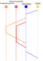

# リリース運用ルール(作成中)
---

## ブランチ役割
|ブランチ名|説明|
| --- | ---|
| main | プロダクトリリース用ブランチ。mainブランチへのマージはリリース責任者によって実施する。|
| develop | 開発用ブランチ。developブランチへのマージはマージ責任者以上の権限を必要とする。|
| feature/xxxxx | developから分岐し、本ワーキングメンバーであれば誰でも作成可能とする。developブランチへのマージを行いたい場合、開発責任者に依頼を行なう。依頼を行う際はPull Requestにて行なうことも可能とする。|
| pages | 自動ビルド結果公開用のブランチ。GitHub Actionsより自動作成されるためメンバは原則修正不可とする。※一定期間にて削除する運用を考慮する。|

## アクタ
|役割|チーム名|説明|
|---|---|---|
|リリース責任者|FHIR-swg leaders|mainブランチに対するマージや、releaseのタグ付けを行なう。 fshファイルに対するversion,statusの一括変更等を行なう。|
|SWG編集責任者|FHIR-swg editor|developブランチの更新、featureブランチ→developブランチへのマージを実施する。各SWGにて１名以上メンバを立てること。|
|SWGメンバ|FHIR-swg member|featureブランチに対する修正およびdevelopに対するPullRequestを行なうことができる。|
|FHIR WG以外| 無所属 | 外部メンバから指摘を受ける場合、Forkを利用してもらいDevelopに対するPull Requestのみを受け付ける。|

## 修正の流れ

1. 「リリース責任者」によりmainブランチよりdevelopに分岐を事前に作成する。
1. 「SWGメンバ(SWG1)」は、developブランチよりfeature/swg1-aaaのブランチを作成し、このブランチ上で編集を行う。
1. 「SWGメンバ(SWB2)」は、developブランチよりfeature/swg2-bbbのブランチを作成し、このブランチ上で編集を行う。
1. 「SWGメンバ(SWG1)」は、修正が完了すると、developへのプルリクエストを発行する。
1. 「SWG編集責任者(SWG1)」は、Pull Requestの修正内容および自動ビルドの結果を確認し、developブランチに対してマージを行なう。
1. 「SWGメンバ(SWG2)」は、修正が完了すると、developへのプルリクエストを発行する。
1. 「SWG編集責任者(SWG2)」は、Pull Requestの修正内容および自動ビルドの結果を確認し、developブランチに対してマージを行なう。
1. 「リリース責任者」は、外部向けに公開する準備が整った段階でdevelopブランチの内容をmainブランチにマージを行なう。

### コンフリクト（衝突）発生時の対処
* 複数ブランチにより同時に同じファイルを修正するとコンフリクト（衝突）が発生する。
* 先勝ちルールであり後からマージする側が解決する。
* Pull Request作成者は、発行時にコンフリクトが発生していないかを確認し、可能であれば解決後Pull Requestを発行すること。

## featureブランチ命名規則
現在どのような修正を行なっているのかを分かりしやすくするため、ブランチ名の一部にSWG名称を一部入れることとする。

|対象| 命名規則 | サンプル |
|---|---|---| 
| SWG内修正 | feature/swg[1-6]-(修正内容) | feature/swg1-github説明方法修正| 
| 複数SWG修正 | feature/swg[1-6]+-(修正内容) | feature/swg46-procedure用語集の修正 |
| SWGに属さない修正 | feature/ext-(修正内容) | feature/ext-GitHubAction修正 |
